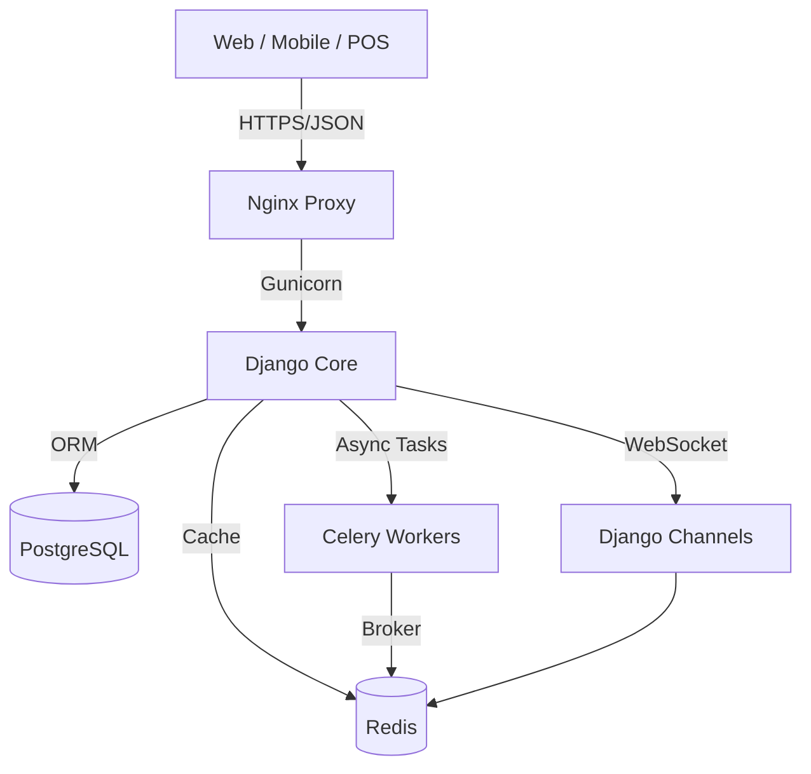

# 📋 Tony ERP - Ultimate Product Requirements Document (PRD)
# وثيقة متطلبات المنتج النهائية والشاملة

---

## 📌 Document Control | معلومات الوثيقة

| Item | Details |
|------|---------|
| **Product Name** | Tony ERP - Intelligent Enterprise Resource Planning |
| **Version** | 3.0.0 (Ultimate Edition) |
| **Date** | February 8, 2026 |
| **Status** | Production Ready ✅ |
| **Owner** | Tony ERP Team |
| **Format** | Unified Master Document |
| **Total Modules** | 79 Modules |
| **Total Models** | 629+ Models |
| **API Endpoints** | 5,300+ URLs |

---

## 📖 Table of Contents | الفهرس

1.  [Executive Summary (الملخص التنفيذي)](#1-executive-summary)
2.  [Vision & Goals (الرؤية والأهداف)](#2-vision--goals)
3.  [System Architecture (بنية النظام)](#3-system-architecture)
4.  [Functional Modules Catalog (كتالوج الوحدات - 79 وحدة)](#4-functional-modules-catalog)
5.  [Data Schema & Models (نماذج البيانات)](#5-data-schema--models)
6.  [API Reference (واجهة برمجة التطبيقات)](#6-api-reference)
7.  [Security & Compliance (الأمان والامتثال)](#7-security--compliance)
8.  [Integrations (التكاملات)](#8-integrations)
9.  [Deployment & DevOps (النشر والتشغيل)](#9-deployment--devops)
10. [Roadmap & KPIs (خارطة الطريق ومؤشرات الأداء)](#10-roadmap--kpis)

---

## 1. Executive Summary | الملخص التنفيذي

**Tony ERP** is a comprehensive, cloud-native Enterprise Resource Planning system designed specifically for the MENA region. It combines traditional ERP strengths with modern AI capabilities, full Arabic (RTL) support, and compliance with local regulations like ZATCA.

### 🌟 Key Differentiators (ما يميز النظام)

*   **Holistic Solution (79 Modules):** Covers every aspect of business from Accounting and Inventory to AI Chatbots and Mattress Manufacturing.
*   **AI-First Approach:** Built-in AI for pricing (Smart Pricing), customer service (WhatsApp AI), and business intelligence.
*   **Local Compliance:** Native support for ZATCA E-invoicing (Phase 1 & 2) and VAT regulations in Saudi Arabia and Egypt.
*   **Modern Tech Stack:** Built on Django, React/Bootstrap, PostgreSQL, and Redis, deployed via Docker & Kubernetes.
*   **Specialized Verticals:** Deep features for manufacturing (specifically Mattresses/Furniture) and Retail (POS).

### 📊 System Statistics (إحصائيات النظام)

| Metric | Value | Note |
|:-------|:------|:-----|
| **Modules** | **79** | Functional Apps |
| **Data Models** | **629+** | Database Tables |
| **API Endpoints** | **5,300+** | RESTful URLs |
| **Languages** | **Ar / En** | Full RTL Support |
| **Architecture** | **Monolithic Modular** | Scalable & Decoupled |

---

## 2. Vision & Goals | الرؤية والأهداف

### Vision
> To become the de-facto ERP solution for SMEs in the MENA region by democratizing access to enterprise-grade AI tools and providing a seamless, localized user experience.

### Strategic Goals
1.  **Automation:** Reduce manual data entry by 70% through AI and integrations.
2.  **Compliance:** Maintain 100% compliance with changing regional regulations (ZATCA, etc.).
3.  **Speed:** Sub-2 second response time for 95% of transactions.
4.  **Scalability:** Support up to 100,000 daily transactions per tenant.
5.  **Intelligence:** Provide actionable insights, not just data reporting.

---

## 3. System Architecture | بنية النظام

### 🏗️ High-Level Architecture

The system follows a **Django Modular Monolith** pattern, exposing a **RESTful API** for frontend clients (Web, Mobile, POS).

### 🛠️ Technology Stack

| Layer | Technology | Details |
|:------|:-----------|:--------|
| **Backend** | **Python 3.11+** | The core language. |
| **Framework** | **Django 5.2.5** | Robust, secure web framework. |
| **API** | **DRF 3.14+** | Django REST Framework for APIs. |
| **Database** | **PostgreSQL 15** | Primary relational database. |
| **Cache/Queue** | **Redis 7** | Caching, Session, Celery Broker. |
| **Frontend** | **Bootstrap 5 + JS** | Responsive, RTL-ready UI. |
| **Real-time** | **Django Channels** | WebSockets for notifications/chat. |
| **Container** | **Docker** | Containerization for all services. |
| **Orchestration**| **Kubernetes** | Scalable deployment (K8s ready). |

### 📂 Project Structure

The project is organized into `spec-kit` documented domains:
*   `core/`: Shared utilities, middleware, and base classes.
*   `accountant_pro/`: Project configuration (settings, urls).
*   `[app_name]/`: 79 separate apps (e.g., `accounting`, `sales`, `inventory`).

## 4. Functional Modules Catalog | كتالوج الوحدات (79 Modules)

### 4.1. Financial & Accounting Modules (16 Modules)

The backbone of the system, fully compliant with **IFRS** and **ZATCA Key Regulations**.

#### 1. General Accounting (`accounting`)
*   **Models:** 30+ (JournalEntry, Account, FiscalYear, etc.)
*   **Key Features:**
    *   **Chart of Accounts:** Multi-level, flexible structure.
    *   **Automated Journals:** System-generated entries for all transactions.
    *   **Financial Statements:** Balance Sheet, P&L, Cash Flow (Real-time).
    *   **Cost Centers:** Detailed tracking for projects/departments.

#### 2. Bank Reconciliation (`bank_reconciliation`)
*   **Models:** 4
*   **Key Features:**
    *   Import bank statements (CSV/MT940).
    *   **AI Matching:** Automatically reconcile similar transactions.
    *   Discrepancy handling workflow.

#### 3. Bank Integration (`bank_integration`)
*   **Models:** 5
*   **Key Features:**
    *   Direct Open Banking API connections.
    *   Automated balance updates.
    *   Initiate transfers from ERP (requires approval).

#### 4. Budgeting (`budgeting`)
*   **Models:** 5
*   **Key Features:**
    *   Planned vs. Actual analysis.
    *   Cross-departmental budget requests.
    *   **Alerts:** Exceeding threshold notifications.

#### 5. Treasury Management (`treasury_management`)
*   **Models:** 4
*   **Key Features:**
    *   Liquidity forecasting.
    *   Cash position analysis.
    *   Investment tracking.

#### 6. Tax Management (`taxes`)
*   **Models:** 7
*   **Key Features:**
    *   Configurable tax rules (VAT, Withholding, etc.).
    *   Tax groups and exemptions.
    *   Multi-country support.

#### 7. Advanced Tax System (`tax_system`)
*   **Models:** 4
*   **Key Features:**
    *   VAT Return generation (Saudi/Egypt specific formats).
    *   Tax audit trail.
    *   Complex calculation logic.

#### 8. ZATCA Integration (`zatca_integration`)
*   **Models:** 3
*   **Key Features:**
    *   **Phase 1 (Generation):** QR Code & XML generation.
    *   **Phase 2 (Integration):** Direct API linking with ZATCA portal.
    *   Cryptographic Stamp & Hash generation.
    *   CSR & Certificate management.

#### 9. Payments (`payments`)
*   **Models:** 5
*   **Key Features:**
    *   Payment Gateways (Stipe, HyperPay, STC Pay).
    *   Batch payments.
    *   Payment allocation to invoices.

#### 10. Installments (`installments`)
*   **Models:** 13
*   **Key Features:**
    *   Installment agreements & contracts.
    *   **Guarantors:** Track guarantor details and liability.
    *   Late fees calculation.
    *   Early settlement logic.

#### 11. Fixed Assets (`fixed_assets`)
*   **Models:** 5
*   **Key Features:**
    *   Asset Register & Lifecycle (Acquisition -> Disposal).
    *   **Depreciation:** Straight-line, Declining Balance, etc.
    *   Maintenance integration.

#### 12. Partners (`partners`)
*   **Models:** 4
*   **Key Features:**
    *   Unified directory for Customers & Suppliers.
    *   Credit limits and ratings.
    *   Contact management.

#### 13. Reports (`reports`)
*   **Models:** 8
*   **Key Features:**
    *   Standard reports library.
    *   Export to PDF, Excel, JSON.
    *   Automated scheduled emails.

#### 14. Report Builder (`report_builder`)
*   **Models:** 6
*   **Key Features:**
    *   **Drag-and-Drop** custom report creation.
    *   Custom formulas and aggregations.
    *   Save and share templates.

#### 15. Data Import (`data_import`)
*   **Models:** 3
*   **Key Features:**
    *   Bulk upload from Excel/CSV with validation.
    *   Error reporting and correction interface.
    *   Field mapping templates.

#### 16. Exports (`exports`)
*   **Models:** 2
*   **Key Features:**
    *   System-wide data export tools.
    *   Security controls on bulk exports.

---

### 4.2. Operations Modules (28 Modules)

End-to-end supply chain, sales, and manufacturing.

#### 17. Inventory Management (`inventory`)
*   **Models:** 18
*   **Key Features:**
    *   Multi-warehouse support with location bins.
    *   **Traceability:** Serial/Lot tracking.
    *   Stock Moves, Adjustments, Transfers.
    *   Stock Valuation (FIFO, Weighted Avg).

#### 18. Sales Management (`sales`)
*   **Models:** 13
*   **Key Features:**
    *   Quotations -> Sales Orders -> Invoices workflow.
    *   Price Lists & Discount policies.
    *   Sales Team targets & commissions.

#### 19. Procurement (`purchases`)
*   **Models:** 22
*   **Key Features:**
    *   RFQs (Request for Quotation).
    *   Purchase Orders & Agreements.
    *   Three-way matching (PO, Receipt, Bill).
    *   Vendor Logic and Scorecards.

#### 20. Point of Sale (`pos`)
*   **Models:** 7
*   **Key Features:**
    *   **Offline Capability:** Works without internet.
    *   Touch-optimized interface.
    *   Hardware integration (Printers, Scanners, Scales).
    *   Shift management & cash control.

#### 21. Manufacturing (`production`)
*   **Models:** 25
*   **Specialty:** Mattress & Furniture Factory Ready.
*   **Key Features:**
    *   **BOM:** Multi-level Bill of Materials with variants.
    *   **Work Orders:** Track progress per Work Center.
    *   **Routing:** Define operation sequnece (Cutting -> Sewing).
    *   Scrap & By-product handling.

#### 22. Quality Control (`quality_control`)
*   **Models:** 5
*   **Key Features:**
    *   Control Points (Pass/Fail, Measurement).
    *   Inspections at Receiving, In-Process, or Final.
    *   Quality Alerts.

#### 23. Shipping (`shipping`)
*   **Models:** 8
*   **Key Features:**
    *   Integration with carriers (Aramex, SMSA, DHL).
    *   Label printing (ZPL/PDF).
    *   Shipment tracking updates.

#### 24. Branch Management (`branches`)
*   **Models:** 18
*   **Key Features:**
    *   Multi-branch configuration (each with own settings).
    *   Inter-branch transfers.
    *   Consolidated reporting.

#### 25. Showrooms (`showrooms`)
*   **Models:** 13
*   **Key Features:**
    *   Showroom-specific inventory.
    *   Display item management.
    *   Sales floor tracking.

#### 26. Fleet Management (`fleet`)
*   **Models:** 9
*   **Key Features:**
    *   Vehicle lifecycle & maintenance log.
    *   Fuel consumption tracking.
    *   Driver assignments.

#### 27. Maintenance (`maintenance`)
*   **Models:** 10
*   **Key Features:**
    *   **Preventive:** Schedule based on time/usage.
    *   **Corrective:** Break-down requests.
    *   Equipment/Asset uptime tracking.

#### 28. Projects (`projects`)
*   **Models:** 11
*   **Key Features:**
    *   Tasks, Milestones, Timesheets.
    *   Project P&L.
    *   Resource Allocation.

#### 29. Contracting (`contracting`)
*   **Models:** 8
*   **Key Features:**
    *   Construction-specific workflows.
    *   Subcontractor management.
    *   Progress billing (Mustakhlas).

#### 30. Contract Management (`contract_management`)
*   **Models:** 4
*   **Key Features:**
    *   Legal contract lifecycle.
    *   Renewal alerts.

#### 31. Tendering (`tender_bidding`)
*   **Models:** 5
*   **Key Features:**
    *   Manage incoming/outgoing tenders.
    *   Bid estimation tools.

#### 32. E-Commerce (`ecommerce`)
*   **Models:** 42 (Largest Module)
*   **Key Features:**
    *   Full-featured online store backend.
    *   Product catalog, Cart, Checkout.
    *   Customer portal.

#### 33. WooCommerce Integration (`woocommerce_integration`)
*   **Models:** 5
*   **Key Features:**
    *   Two-way sync (Products, Stock, Orders).

#### 34. Home Services (`home_services`)
*   **Models:** 8
*   **Key Features:**
    *   Service appointment booking.
    *   Technician dispatching.

#### 35. Smart Pricing (`smart_pricing`)
*   **Models:** 16
*   **Key Features:**
    *   **Dynamic Logic:** Price based on demand/competition.
    *   Rules engine for bulk updates.
    *   Margin protection logic.

#### 36. Subscriptions (`subscriptions`)
*   **Models:** 3
*   **Key Features:**
    *   Recurring billing.
    *   SaaS or Service contracts.

#### 37. Loyalty Program (`loyalty`)
*   **Models:** 5
*   **Key Features:**
    *   Points accrual & redemption.
    *   Membership tiers (Silver, Gold, etc.).

#### 38. Warranty (`warranty_management`)
*   **Models:** 3
*   **Key Features:**
    *   Warranty registration logic.
    *   Claim validation against purchase date.

#### 39-44. Additional Ops Modules
*   `approvals` (2): Universal approval workflow engine.
*   `eservices` (11): Government service integrations.
*   `printing` (2): Print server management (CUPS integration).
*   `sales_forecasting` (5): AI prediction models.
*   `marketing_campaigns` (5): Email/SMS blasts.
*   `customer_profitability` (2): Analytics on best customers.

---

### 4.3. HR & Admin Modules (8 Modules)

#### 45. Human Resources (`hr`)
*   **Models:** 41
*   **Key Features:**
    *   Employee Database (360 view).
    *   Appraisals, Contracts, Documents.
    *   Recruitment pipeline.

#### 46. Attendance (`attendance`)
*   **Models:** 6
*   **Key Features:**
    *   Biometric device integration.
    *   Shift scheduling & Overtime logic.
    *   Leave management.

#### 47. User Management (`users`)
*   **Models:** 7
*   **Key Features:**
    *   RBAC Roles & Permissions.
    *   User Groups.

#### 48. Accounts (`accounts`)
*   **Models:** 3
*   **Key Features:**
    *   SSO, 2FA settings.
    *   Profile management.

#### 49-52. Additional Admin Modules
*   `tasks` (8): Internal todo/project tasks.
*   `energy_management` (4): Utility tracking for factories.
*   `license_management` (3): Track software/trade licenses.
*   `compliance_management` (5): Regulatory adherence tracking.

---

### 4.4. AI & Support Modules (21 Modules)

#### 53-58. AI Suite
*   `ai_assistant` (5): Chatbot for users.
*   `ai_analytics` (4): Anomaly detection.
*   `voice_assistant` (4): Voice commands.
*   `business_intelligence` (5): KPI Dashboards.
*   `competitive_intelligence` (4): Competitor tracking.
*   `risk_management` (5): Risk matrix & scoring.

#### 59-60. CRM Suite
*   `crm` (37): Leads, Pipelines, Activities.
*   `advanced_crm` (4): Advanced scoring & automation.

#### 61-68. Communications
*   `helpdesk`: Ticket system.
*   `complaint_management`: Formal grievance handling.
*   `notifications`: Real-time alerts.
*   `advanced_notifications`: Multi-channel broadcasting.
*   `internal_chat`: Slack-like internal comms.
*   `video_calls`: WebRTC integration.
*   `sound_notifications`: Audio alerts for POS/Kitchen.
*   `correspondence_management`: Incoming/Outgoing mail tracking.

#### 69-79. System Utilities
*   `digital_signatures`, `cloud_backup`, `cms`, `collaborative_docs`, `custom_dashboard`, `theme_system`, `smartwatch`, `quick_access`, `intellectual_property`, `core`, `api`.

---

## 5. Data Schema & Models | نماذج البيانات

The system uses a **PostgreSQL** relational database with **629+ models**.

### 5.1. Core ERD Relationships
*   **Partners** (Customer/Supplier) <--> **Invoices/Orders**
*   **Products** <--> **Inventory Stock** (via Location) <--> **BOM**
*   **GL Accounts** <--> **Journal Entries** <--> **Cost Centers**
*   **Users** <--> **Roles** <--> **Permissions**

### 5.2. Key Key Tables Schema

#### `inventory_product`
| Field | Type | Description |
|:------|:-----|:------------|
| `sku` | Validated String | Unique Stock Keeping Unit. |
| `barcode` | String | EAN/UPC barcode. |
| `cost_price` | Decimal(12,2) | Moving Average Cost. |
| `stock_quantity` | Decimal | Real-time stock (computed). |

#### `sales_invoice`
| Field | Type | Description |
|:------|:-----|:------------|
| `zatca_uruid` | UUID | Unique ID for Tax Authority. |
| `zatca_hash` | SHA256 | Cryptographic chain hash. |
| `status` | Enum | Draft, Posted, Paid, Cancelled. |

---

## 6. API Reference | واجهة برمجة التطبيقات

A fully documented **RESTful API** powered by Django REST Framework (DRF).

### 6.1. Authentication
*   **JWT (JSON Web Tokens):** Standard Bearer token auth.
*   **Refresh Tokens:** Long-lived tokens for mobile apps.
*   **Biometric Auth:** Supported via mobile app SDKs.

### 6.2. Endpoint Structure
*   `GET /api/v1/resource/`: List items (paginated).
*   `POST /api/v1/resource/`: Create new item.
*   `GET /api/v1/resource/{id}/`: Retrieve detail.
*   `PUT/PATCH /api/v1/resource/{id}/`: Update item.
*   `DELETE /api/v1/resource/{id}/`: Remove item.

### 6.3. Rate Limiting
*   **Public API:** 60 requests/minute.
*   **Authenticated:** 1000 requests/minute.
*   **Internal Services:** Unlimited.

---

## 7. Security & Compliance | الأمان والامتثال

### 7.1. Defense in Depth
1.  **Network:** Cloudflare / AWS WAF protection against DDoS.
2.  **App:** Django Security Middleware (XSS, CSRF, Clickjacking protection).
3.  **Data:** AES-256 encryption for sensitive fields (Passwords, API Keys).
4.  **Audit:** Full `audit_log` for every Create/Update/Delete action.

### 7.2. Roles & Permissions (RBAC)
*   **Granularity:**
    *   Module Access (View Sales).
    *   Action Access (Create Invoice).
    *   Field Access (View Cost Price).
    *   Data Scope (Own Branch Only vs. All Branches).

### 7.3. ZATCA Compliance (KSA)
*   **Phase 1:** Generation of GS1-compliant QR Codes.
*   **Phase 2:** XML Signing & API Reporting to Fatoora Portal.
*   **Anti-Tamper:** Chained hashing of invoices prevents undetectable alteration.

---

## 8. Integrations | التكاملات

### 8.1. Payment Gateways
*   **HyperPay / PayTabs:** Credit Card (Visa/Master), Mada.
*   **STC Pay:** Direct wallet integration.
*   **Stripe / PayPal:** International payments.

### 8.2. Logistics
*   **Aramex / SMSA / DHL:** Auto-create Airway Bills (AWB).
*   **Track & Trace:** Webhook updates for shipment status.

### 8.3. Communications
*   **WhatsApp (Meta API):** Verified Business Account integration.
*   **SMS:** Twilio / Unifonic / MSEGAT.
*   **Email:** SendGrid / Amazon SES.

### 8.4. E-Commerce
*   **WooCommerce:** Bi-directional sync via REST API.
*   **Salla / Zid:** (Planned) Native connector apps.

---

## 9. Deployment & DevOps | النشر والتشغيل

### 9.1. Infrastructure
*   **Containerization:** Docker images for Web, Worker, Beat.
*   **Orchestration:** Kubernetes (EKS/GKE) or Docker Swarm.
*   **CI/CD:** GitHub Actions pipeline (Test -> Build -> Deploy).

### 9.2. Monitoring Stack
*   **Sentry:** Real-time error tracking.
*   **Prometheus:** Metric collection (Requests/sec, Latency).
*   **Grafana:** Visualization dashboards.
*   **Flower:** Celery task monitoring.

---

## 10. Roadmap & KPIs | خارطة الطريق والمؤشرات

### 10.1. Success Metrics (KPIs)
*   **Uptime:** 99.9% availability.
*   **Performance:** < 500ms API response time (95th percentile).
*   **Adoption:** 80% user retention rate.

### 10.2. Future Roadmap
*   **Q3 2026:** Native Mobile Apps (Flutter) v2.0.
*   **Q4 2026:** AI Predictive Inventory Ordering.
*   **Q1 2027:** Blockchain integration for Supply Chain transparency.

---

**End of Comprehensive PRD - Tony ERP**
